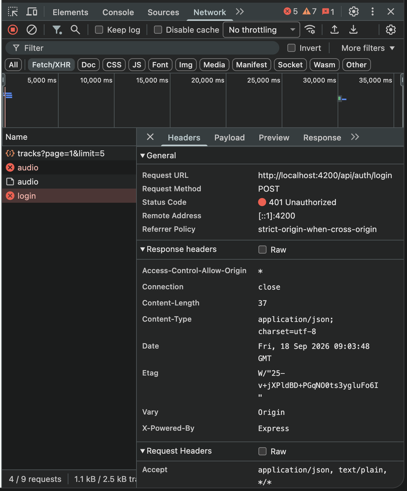
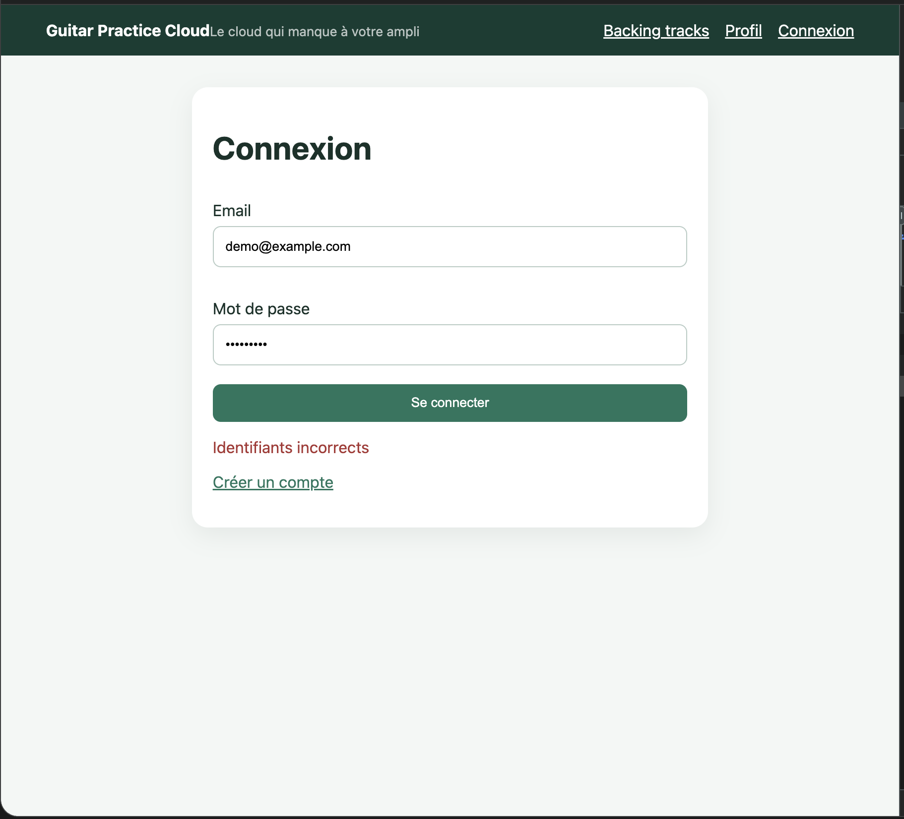
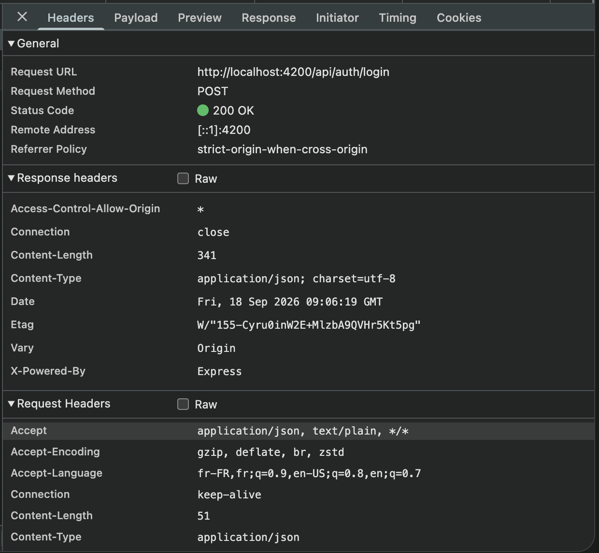
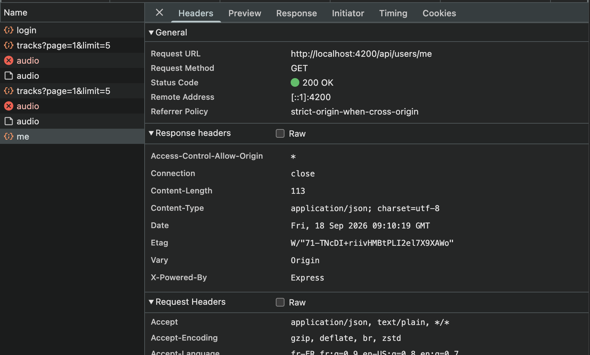

# Rapport d'usage de l'IA

Pour chaque mission, détailler et fournir des explications concernant : objectif; prompt principal; plan proposé par l'agent; vérifications réalisées par le binôme; erreurs ou propositions rejetées; fichiers effectivement modifiés; preuve de fonctionnement; ce que chaque membre sait maintenant expliquer sans l'agent.

Assistant utilisé : Claude Code (modèles Claude Sonnet 5 / Haiku 4.5 selon les sessions).

---

# TP1

## Préparation base de données (hors Atlas)

**Objectif** : faire fonctionner le backend avec une base MongoDB, en
remplaçant MongoDB Atlas par une instance MongoDB personnelle déjà en place
sur un NAS.

**Prompt principal** : demande de diagnostic ("pourquoi je ne peux pas me
connecter à mon Mongo"), puis "fait le reste à faire de atlas stp".

**Plan proposé par l'agent** : diagnostic réseau (port, SSH, identifiants),
configuration de `backend/.env` avec l'URI du NAS, résolution d'un conflit
de port local, lancement backend + frontend, vérification de bout en bout
(health check, login, upload, collections Mongo).

**Vérifications réalisées par le binôme** : relance manuelle de
`npm start` côté backend pour lire nous-mêmes les logs de connexion Mongo
au démarrage (succès/échec, sans jamais afficher l'URI complète, conforme à
la consigne de ne pas logger de secrets) ; test manuel du flux complet dans
le navigateur (login avec le compte démo, upload d'un fichier) en plus des
vérifications faites avec l'agent ; relecture de `backend/.env` pour
confirmer que seule la variable `MONGODB_URI` avait changé et qu'aucun
autre paramètre (`JWT_SECRET`, port) n'avait été touché par erreur.

**Erreurs ou propositions rejetées** : première tentative de connexion
Mongo sans authentification a échoué (le conteneur a `--auth` activé) ;
identifiants retrouvés et validés manuellement avec l'utilisateur.

**Fichiers effectivement modifiés** : `backend/.env` (non versionné),
`frontend-starter/proxy.conf.json` (port 3000 → 3001, conflit avec un autre
outil local).

**Preuve de fonctionnement** : `GET /api/health` → `200 {"status":"ok"}`,
login avec le compte démo → JWT reçu, collections `users`/`tracks`
confirmées dans Mongo via `mongosh`.

**Ce que chaque membre sait maintenant expliquer sans l'agent** : la
différence entre une variable d'environnement lue par `node --env-file=.env`
et une valeur codée en dur ; pourquoi `.env` est gitignoré alors que
`.env.example` est versionné ; comment lire un message d'erreur de
connexion Mongoose (`MongoServerError: Authentication failed`) pour
comprendre qu'il s'agit d'un problème d'identifiants et non de réseau.

---

## Mission 0 — Cartographie

**Objectif** : repérer les responsabilités de l'application Angular
(composant racine, routes, HttpClient, services/models/pages, mécanisme
JWT) et produire un schéma annoté du flux de connexion, sans modifier le
code.

**Prompt principal** : "on fait la mission 0 stp explique moi bien avec de
la doc dans un dossier maintenant stp", puis demandes d'explications
pédagogiques point par point (composant racine, séparation service/composant,
intercepteur vs guard).

**Plan proposé par l'agent** : lecture des fichiers sources réels
(`app.ts`, `routes.ts`, `main.ts`, `auth.service.ts`, `auth.interceptor.ts`,
`auth.guard.ts`, `app.js` backend), rédaction d'une documentation avec
extraits de code réels, vérification croisée avec `API_CONTRACT.md` pour
les routes publiques/protégées, puis production d'un diagramme Excalidraw
du flux de login.

**Vérifications réalisées par le binôme** : relecture de
`CARTOGRAPHIE.md` fichier par fichier en rouvrant chaque source cité
(`app.ts`, `routes.ts`, `auth.service.ts`, `auth.interceptor.ts`,
`auth.guard.ts`) dans l'éditeur pour confirmer que les extraits collés
dans la doc correspondaient exactement au code réel ; relecture du
diagramme `flux-login.png` étape par étape en le comparant au code pour
vérifier qu'aucune étape (ex : l'ajout du header `Authorization` par
l'intercepteur) n'avait été omise ou inventée.

**Erreurs ou propositions rejetées** : premier diagramme fait en Mermaid,
remplacé par un vrai fichier Excalidraw à la demande explicite (l'utilisateur
avait l'extension VS Code Excalidraw) ; le rendu de validation automatique
du diagramme a échoué une première fois à cause d'un bug du CDN `esm.sh`,
contourné avec `jsdelivr`.

**Fichiers effectivement modifiés** : création de `tp1/mission_0/CARTOGRAPHIE.md`,
`tp1/mission_0/flux-login.md`, `tp1/mission_0/flux-login.excalidraw`,
`tp1/mission_0/flux-login.png`. Aucun fichier de code touché (mission de
lecture uniquement, conforme à la consigne).

**Preuve de fonctionnement** : diagramme rendu et vérifié visuellement
(voir `tp1/mission_0/flux-login.png`) ; réponses aux questions du sujet
(routes utilisées, emplacement de la mise à jour du profil) vérifiées
contre le code source et `API_CONTRACT.md`.

**Ce que chaque membre sait maintenant expliquer sans l'agent** : le rôle
du `selector` dans `@Component` (l'ancrage HTML du composant, `app-root`
dans `index.html`) ; la différence entre `authInterceptor` (branché sur
*toutes* les requêtes HTTP sortantes, ajoute le header `Authorization` et
réagit aux erreurs 401) et `authGuard` (branché sur la navigation, bloque
l'accès à une route avant même qu'un appel HTTP soit fait) ; pourquoi le
token est stocké à la fois en Signal (`auth.token()`, réactif pour l'UI) et
en `localStorage` (seul moyen de survivre à un F5, puisqu'un Signal est
réinitialisé à chaque rechargement de page) ; le flux complet
composant → service (`AuthService`/`TrackService`) → `HttpClient` → route
Express → middleware `auth` → Mongoose, et pourquoi Angular ne doit jamais
appeler MongoDB directement.

---

## Mission 1 — Auth & Profil

**Objectif** : compléter la partie utilisateur du frontend (formulaires,
service, gestion de session), en particulier le bouton de déconnexion et la
gestion d'un token expiré/invalide (401).

**Constat de départ** : `frontend-starter` n'était pas un starter vide —
login, register, profil et upload étaient déjà largement implémentés. Deux
manques identifiés en Mission 0 restaient à combler : pas de bouton logout
dans le header, pas de redirection automatique vers `/login` en cas de 401.

**Prompt principal** : "Ok pour mission 0 c'est fini on peut passer a la
mission 1".

**Plan proposé par l'agent** : ajout d'un bouton de déconnexion dans
`app.html`/`app.ts` (affiché selon la présence du token, pas seulement du
profil chargé, pour rester correct après un F5) ; extension de
`auth.interceptor.ts` pour intercepter les réponses 401 **uniquement**
quand une requête portait déjà un token (pour ne pas interférer avec un
login qui échoue volontairement), déclenchant `logout()` + redirection.

**Vérifications réalisées par le binôme** : lecture ligne à ligne du diff
sur `app.html`/`app.ts` et `auth.interceptor.ts` avant acceptation ;
vérification dans le navigateur que le bouton "Déconnexion" est bien
conditionné à `auth.token()` (présent dès la connexion, encore présent
après un F5) et non à `auth.currentUser()` (qui se recharge de façon
asynchrone) ; test manuel de déconnexion volontaire (clic sur le bouton →
retour à `/login`, token supprimé de `localStorage`) ; test manuel du cas
401 en modifiant à la main la valeur du token dans `localStorage` via les
DevTools puis en rechargeant une page protégée (`/profile` ou `/tracks`) :
redirection automatique vers `/login` observée ; vérification qu'un
mauvais mot de passe sur l'écran de login (401 **sans** token envoyé)
n'entraîne pas cette redirection et affiche bien le message d'erreur du
formulaire ; relecture et exécution du fichier de tests ajouté
`auth.interceptor.spec.ts` (`npm test`, 4 tests, tous verts) pour
confirmer que ce comportement est aussi couvert automatiquement, pas
seulement observé une fois à la main.

**Erreurs ou propositions rejetées** : première version du header basée sur
`auth.currentUser()` seul — rejetée en interne par l'agent avant même de
la proposer au binôme, car `currentUser` n'est pas réhydraté après un
rechargement de page (seul `token` l'est depuis `localStorage`), ce qui
aurait fait disparaître le bouton logout après un F5 alors que
l'utilisateur reste connecté.

**Fichiers effectivement modifiés** : `frontend-starter/src/app/components/app/app.ts`,
`frontend-starter/src/app/components/app/app.html`,
`frontend-starter/src/app/shared/interceptors/auth.interceptor.ts`.

**Preuve de fonctionnement** : `npm test` dans `frontend-starter` →
`Test Files 1 passed (1)`, `Tests 4 passed (4)` sur
`auth.interceptor.spec.ts` (en-tête `Authorization` ajouté quand un token
existe, absent sinon, déconnexion + redirection `/login` sur 401 avec
token, pas de redirection sur 401 sans token) ; observation manuelle dans
l'onglet Network des DevTools du header `Authorization: Bearer <token>`
sur les requêtes vers `/api/users/me` une fois connecté, puis de la requête
qui échoue en 401 et de la navigation vers `/login` juste après lorsqu'on
force un token invalide.

Captures d'écran :

- Connexion refusée (DevTools, `POST /api/auth/login` → `401`) :
  
- Connexion refusée (vue navigateur, message "Identifiants incorrects") :
  
- Connexion réussie (DevTools, `POST /api/auth/login` → `200`) :
  
- `GET /api/users/me` → `200` (DevTools) :
  

**Ce que chaque membre sait maintenant expliquer sans l'agent** :
pourquoi conditionner l'affichage du bouton logout sur `auth.token()`
plutôt que sur `auth.currentUser()` (seul `token` est réhydraté depuis
`localStorage` au démarrage de l'app ; `currentUser` dépend d'un appel
HTTP à `/api/users/me` qui met un instant à répondre, donc s'y fier
ferait clignoter/disparaître le bouton après un F5) ; pourquoi
l'intercepteur ne déclenche la déconnexion que si **la requête sortante
portait déjà un token** (`if (token && error.status === 401)`) — un 401
sur `/api/auth/login` avec un mauvais mot de passe ne doit pas être traité
comme une session expirée, sinon on écraserait le message d'erreur du
formulaire de login par une redirection intempestive ; la différence entre
un test qui vérifie le comportement HTTP simulé (`HttpTestingController`,
`auth.interceptor.spec.ts`) et un test manuel dans le vrai navigateur — les
deux sont complémentaires, l'un est rejouable en CI, l'autre confirme le
rendu réel.

---

## Fonctionnalité additionnelle — disponibilité des fichiers audio

**Objectif** : éviter qu'un binôme utilisant chacun son propre backend
local (mais une base Mongo partagée) ne tombe sur des pistes dont le
fichier physique n'existe que sur la machine de l'autre.

**Prompt principal** : "il faut pouvoir faire un vérif si le fichier n'est
pas dispo il est grisé [...] si le fichier n'est pas dispo sur la machine
utilisateur on coupe".

**Plan proposé par l'agent** : ajout d'une méthode `isAvailable()` dans
`TrackService` (requête `HEAD` sur la route existante, sans toucher au
backend), vérification de chaque piste au chargement de la liste, grisage
visuel + désactivation du bouton de lecture.

**Vérifications réalisées par le binôme** : test en conditions réelles —
insertion directe d'un faux document dans Mongo (métadonnée présente,
fichier absent du disque), confirmation visuelle dans le navigateur que la
piste apparaît grisée avec le bouton désactivé.

**Fichiers effectivement modifiés** :
`frontend-starter/src/app/shared/services/track.service.ts`,
`frontend-starter/src/app/components/tracks-page/tracks-page.ts`,
`frontend-starter/src/app/components/tracks-page/tracks-page.html`,
`frontend-starter/src/app/components/tracks-page/tracks-page.css`.

**Preuve de fonctionnement** : testé et confirmé par le binôme ("ok top ça
marche c'est nikel").

---

## Discussion conceptuelle (mode chat) — service Angular, FormData, multer, Observable vs Promise

**Objectif** : usage de l'assistant en mode "discussion générale" tel que
recommandé par `CONSEILS_POUR_UTIISER_ASSISTANT_AI.md` (§1) — poser des
questions de cours pour combler des manques de compréhension, sans
générer ni modifier de code.

**Prompt principal** : les quatre questions listées telles quelles par
l'exemple du document de conseils : « Explique-moi le concept de service
en Angular. », « Qu'est-ce que l'API `FormData` des navigateurs ? »,
« Qu'est-ce que le module npm `multer` ? », « Quelle est la différence
entre un `Observable` et une `Promise` ? ».

**Plan proposé par l'agent** : réponse directe à chacune des quatre
questions, en rattachant chaque concept générique à son usage concret dans
le repo (`AuthService`/`TrackService` comme seuls points d'accès à
`HttpClient`, `FormData` utilisé pour l'upload de piste audio, `multer`
tel que configuré dans `backend/src/app.js` — `diskStorage`, UUID, limite
25 Mo, allowlist MIME, suppression du fichier orphelin en cas d'échec
Mongo —, et `Observable` vs `Promise` en lien avec la convention du repo
imposant un `subscribe({ next, error })` explicite sur chaque appel
`HttpClient`), plutôt que des définitions génériques hors contexte.

**Vérifications réalisées par le binôme** : relecture des passages cités
de `backend/src/app.js` (configuration Multer) et de `CLAUDE.md`
(convention `subscribe({ next, error })`) pour confirmer que les réponses
correspondaient bien au code réel du projet et pas à une réponse
générique non vérifiée.

**Erreurs ou propositions rejetées** : aucune, échange purement
explicatif.

**Fichiers effectivement modifiés** : aucun (mode chat, pas de code
produit ni de fichier touché).

**Preuve de fonctionnement** : non applicable (pas de code exécuté) ;
preuve = capacité du binôme à reformuler chaque réponse ci-dessous.

**Ce que chaque membre sait maintenant expliquer sans l'agent** : la
différence entre un service Angular (`@Injectable`, logique réutilisable
injectée via `inject()`) et un composant ; ce qu'encode concrètement
`multipart/form-data` via `FormData` et pourquoi c'est nécessaire pour
envoyer un fichier binaire en HTTP ; le rôle de `multer` comme middleware
Express qui parse ce multipart et écrit le fichier sur disque avant
l'écriture en base ; pourquoi Angular utilise des `Observable` (RxJS,
lazy, annulables, multi-valeurs) plutôt que des `Promise` (eager, une
seule résolution) pour `HttpClient`, et pourquoi le repo impose de
toujours expliciter `next`/`error` à la souscription.

---

# TP2

## Bascule MongoDB local/Atlas

**Objectif** : pouvoir choisir entre une instance Mongo locale et un
cluster MongoDB Atlas (cloud) au démarrage du backend, sans casser la
configuration existante, en vue de continuer le TP2 avec un Mongo partagé
dans le cloud plutôt que local.

**Contexte** : ce travail a été fait lors d'une session séparée, avant la
reprise du TP2 documentée ci-dessous ; le détail exact du prompt et des
échanges de cette session n'est pas dans cette conversation-ci — cette
entrée est reconstruite à partir du commit produit
(`feat: bascule MongoDB local/Atlas via MONGO_SOURCE`) et de sa relecture.

**Plan (déduit du commit)** : ajout d'une variable `MONGO_SOURCE`
(`local`/`atlas`, défaut `local`) dans `backend/.env`, avec deux URI
séparées (`MONGODB_URI_LOCAL`/`MONGODB_URI_ATLAS`) et un repli sur
l'ancienne variable `MONGODB_URI` seule si `MONGO_SOURCE` est absent (pour
ne pas casser un `.env` déjà en place).

**Vérifications réalisées** (dans cette conversation, après récupération du
commit sur la branche `tp2` par `git cherry-pick`) : relance manuelle du
backend, lecture des logs de démarrage confirmant `[startup] Connecté à
MongoDB (source: atlas)` et `GET /api/health` → `200`, sans jamais afficher
l'URI complète.

**Erreurs ou propositions rejetées** : la branche portant ce changement
(`feat/mongo-source-switch`) avait été créée à partir de la branche `tp2`
au lieu de `main`, donc son merge dans `main` (PR #1) a aussi ramené les
commits TP2 en cours — repérés et corrigés en revert sur `main`, puis le
commit du switch Mongo seul a été rapatrié sur `tp2` par cherry-pick pour
ne garder que ce qui devait y être.

**Fichiers effectivement modifiés** : `backend/src/server.js`,
`backend/.env.example`.

**Preuve de fonctionnement** : `GET /api/health` → `200 {"status":"ok"}`
avec le backend connecté à Atlas (log `source: atlas`), confirmé dans
cette conversation avant de reprendre le travail TP2.

---

## Mission 2 — Bibliothèque paginée

**Objectif** : vérifier/compléter la pagination serveur de la liste des
pistes (`GET /api/tracks?page=&limit=`), sans modifier le backend.

**Prompt principal** : "Ok on peux commencer le TP2 alors", puis "donc tu
as fini tout le tp 2??" (qui a mené à préciser honnêtement ce qui restait
à faire).

**Plan proposé par l'agent** : relecture de `track.service.ts` et
`tracks-page.ts` avant toute modification (constat : la pagination, les
Signals `tracks`/`page`/`pages`/`loading` et l'absence de slicing local
existaient déjà dans le starter) ; ajout du seul point manquant, un Signal
`error` rempli sur échec de `TrackService.list()` et affiché dans le
template avec `role="alert"`.

**Vérifications réalisées par le binôme** : test réel dans le navigateur
(DevTools → Network) — clic sur "Suivant", confirmation que la requête
passe de `page=1&limit=5` à `page=2&limit=5` ; capture d'écran fournie et
relue par l'agent, qui a aussi identifié et expliqué que les lignes
`HEAD /api/tracks/:id/audio` visibles dans la même capture n'étaient pas
liées à la pagination mais à une fonctionnalité différente
(`isAvailable()`, déjà documentée au TP1).

**Erreurs ou propositions rejetées** : aucune sur le code ; une confusion
initiale du binôme entre les requêtes `HEAD` de `isAvailable()` et un
éventuel bug a été clarifiée par relecture du code plutôt que corrigée
"à l'aveugle".

**Fichiers effectivement modifiés** :
`frontend-starter/src/app/components/tracks-page/tracks-page.ts`,
`tracks-page.html`, `tracks-page.css`. Documentation créée :
`tp2/mission_2/MISSION_2.md`, `tp2/mission_2/README.md`.

**Preuve de fonctionnement** : `npx tsc --noEmit` et `npx ng build` sans
erreur ; capture Network confirmant le changement de `page` :
`tp2/mission_2/capture-network-page1.png` et
`tp2/mission_2/capture-network-page2-isavailable.png`.

**Ce que chaque membre sait maintenant expliquer sans l'agent** : pourquoi
la pagination doit être pilotée par le serveur (`skip`/`limit` côté
Mongoose) et non simulée côté client ; pourquoi le Signal `error` est
remis à `''` en tout début de `load()` et pas seulement en cas de succès ;
la différence entre le message générique affiché à l'écran et le détail
technique réservé à `console.error`.

---

## Mission 3 — Upload et lecture audio

**Objectif** : compléter (sans réimplémenter l'existant ni modifier le
contrat HTTP) la validation du fichier avant envoi, les retours visuels
pendant/après l'upload, l'enrichissement des cards, et la propreté mémoire
de la lecture audio (`Blob`/`ObjectURL`).

**Prompt principal** : demande de reprise du TP2 après la bascule Mongo,
puis consigne explicite de continuer sur la Mission 3.

**Constat de départ** (vérifié en relisant le code avant toute
modification) : l'upload et la lecture **fonctionnaient déjà** dans leur
cas nominal (`FormData` correct, `Blob`→`ObjectURL`→`<audio controls>`
déjà en place, y compris la barre de lecture native du navigateur) — ce
qui manquait précisément : validation fichier, état de chargement/anti
double-soumission, erreurs serveur et succès affichés, cards incomplètes
(dont un bug d'affichage de taille : octets affichés comme "Ko" sans
conversion), et absence de révocation de l'`ObjectURL` à la destruction du
composant.

**Plan proposé par l'agent** : ajout de `MAX_FILE_SIZE`/`ALLOWED_MIME_TYPES`
alignés sur les contrôles réels de `backend/src/app.js` ; Signals
`uploading`/`uploadError`/`uploadSuccess` séparés de ceux de la liste ;
réinitialisation du `<input type="file">` via une référence à l'élément
natif (impossible par data-binding classique) ; correction de
`formatSize()` ; `DestroyRef.onDestroy()` pour révoquer l'`ObjectURL`
encore active à la fermeture du composant.

**Vérifications réalisées par le binôme** : test complet dans le
navigateur réel — upload réussi (message de succès, formulaire vidé,
cards avec format/taille/date corrects), lecture audio (lecteur natif
fonctionnel), inspection Network confirmant que la réponse de lecture est
un vrai flux (`Content-Type: audio/mpeg`, `Content-Length`,
`Accept-Ranges: bytes`) **et** que le header `Authorization: Bearer ...`
est bien présent sur cette requête (capture fournie et relue) ; test
"propriétaire uniquement" avec un 2ᵉ compte, confirmant une bibliothèque
vide plutôt qu'un simple 404 isolé — preuve plus solide que ce qui était
initialement demandé, car elle montre que la liste elle-même est filtrée
par `ownerId`, pas seulement la route de lecture individuelle.

**Erreurs ou propositions rejetées** : le test "fichier invalide → erreur
400" n'a pas pu être déclenché tel quel, l'attribut `accept="audio/*"` de
l'`<input>` filtrant déjà la boîte de dialogue du navigateur — comportement
attendu et documenté comme tel plutôt que forcé artificiellement.

**Fichiers effectivement modifiés** :
`frontend-starter/src/app/components/tracks-page/tracks-page.ts`,
`tracks-page.html`, `tracks-page.css`. Documentation créée :
`tp2/mission_3/MISSION_3.md`, `tp2/mission_3/README.md`,
`tp2/mission_3/FLUX_UPLOAD_LECTURE.md` (flux détaillé + rôle de
l'intercepteur JWT sur la requête audio),
`tp2/mission_3/BLOB_OBJECTURL_STREAMING.md` (justification Blob/ObjectURL
et réponses aux 5 questions mémoire/buffering/streaming du sujet).

**Preuve de fonctionnement** : `npx tsc --noEmit` et `npx ng build` sans
erreur ; captures dans `tp2/mission_3/` :
`capture-upload-succes-cards.png`, `capture-lecture-audio.png`,
`capture-network-audio-headers.png`, `capture-proprietaire-liste-vide.png`.

**Ce que chaque membre sait maintenant expliquer sans l'agent** : pourquoi
un `<audio src="...">` direct ne recevrait jamais le header JWT (la balise
déclenche une requête navigateur native, hors du pipeline `HttpClient` où
vit l'intercepteur) et pourquoi c'est précisément la raison de passer par
`Blob`/`ObjectURL` ; pourquoi la validation frontend n'est qu'un confort
et jamais une garantie de sécurité (la seule validation qui protège
réellement le serveur est celle de Multer) ; pourquoi
`URL.revokeObjectURL` est nécessaire (le navigateur garde le `Blob` en
mémoire tant que l'URL n'est pas révoquée, indépendamment du ramasse-miettes
JS) ; la différence entre "upload qui marche une fois" et "upload robuste
aux erreurs/latence/double-clic".

---

# TP3

## Missions 5, 6 et 7 — Suppression, progression d'upload, tests

**Objectif** : ajouter la suppression d'une piste (confirmation, SnackBar,
anti double-clic, gestion 404), la progression d'upload, et des tests
automatisés frontend (+ quelques tests de contrat backend).

**Prompt principal** : « fait une branche avec le tp3 pour le faire avec des
explications et comment tu fais les différentes étapes ».

**Plan proposé par l'agent** : lecture du sujet et du code existant ;
branche `tp3` ; installation d'Angular Material (SnackBar) ; service
(`delete`, `upload` avec événements) ; composant et template ; tests
frontend ; tests backend sans Mongo ; mise à jour de `API_CONTRACT.md` ;
documentation dans `tp3/avancement_tp3.md`.

**Vérifications réalisées** : `npm test` frontend (17/17) et backend (6/6),
`npm run build` OK, test de mutation (URL du DELETE cassée → 8 tests
échouent). **À compléter par le binôme** : test dans le navigateur et
captures Network (non réalisables par l'agent).

**Erreurs ou propositions rejetées** : 4 tests en échec au premier lancement
(pas de `localStorage` dans l'environnement de test) → stub partagé
`shared/testing/local-storage-stub.ts`. Tests backend de pagination et de
propriétaire non écrits (nécessitent une vraie base).

**Fichiers modifiés** : `track.service.ts`, `tracks-page.{ts,html,css}`,
`angular.json` (thème Material), `package.json` (+ `@angular/material`,
`@angular/cdk`), 4 fichiers `*.spec.ts` + stub, `backend/test/api.test.js`,
`API_CONTRACT.md`, `tp3/avancement_tp3.md`.

**Preuve de fonctionnement** : sorties de tests et de build ci-dessus ;
captures Network `tp3/mission_5/capture-network-delete.png` (`DELETE` →
`204`) et `tp3/mission_6/capture-network-upload.png` (`POST` → `201`),
testées en navigateur par le binôme. Les captures initiales exposaient le
JWT : elles ont été recadrées avant d'être versionnées. La barre de
progression n'est pas visible en local sans throttling (envoi quasi
instantané).

**Ce que chaque membre doit savoir expliquer** : voir la section « Restitution
orale » du sujet ; éléments de réponse dans `tp3/avancement_tp3.md`.
